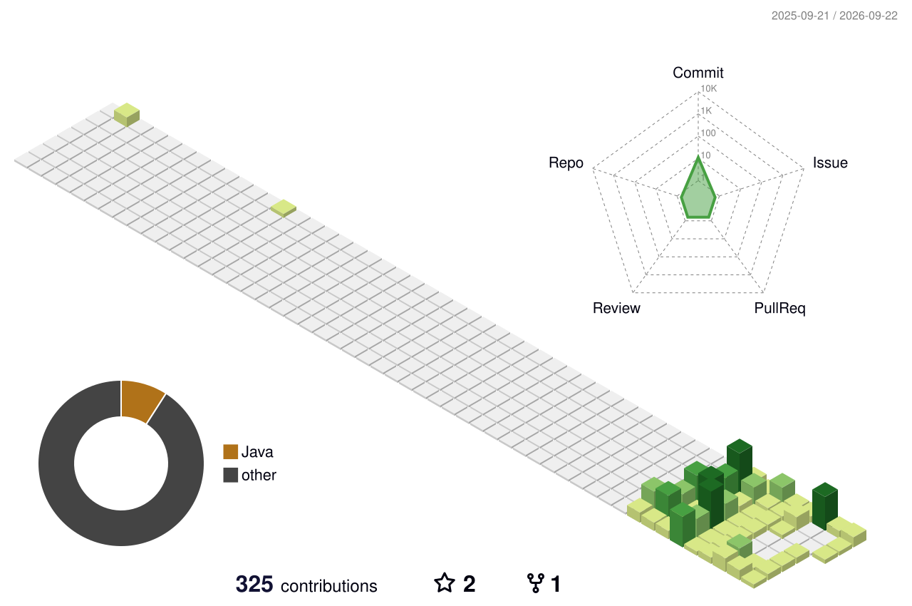

  

<h3 align="center">Nguyễn Huỳnh Minh Thuận</h3>
<h4 align="center">Backend Engineer • Java/Spring Boot & Golang</h4>

  

  

  
  

---

### 🧰 Core Stack

  

  
  
  
  
  
  

---

### 🌆 3D Contribution Calendar

 

  <picture>
    <source media="(prefers-color-scheme: dark)" srcset="./profile-3d-contrib/profile-night-view.svg">
    
  </picture>

---

  

